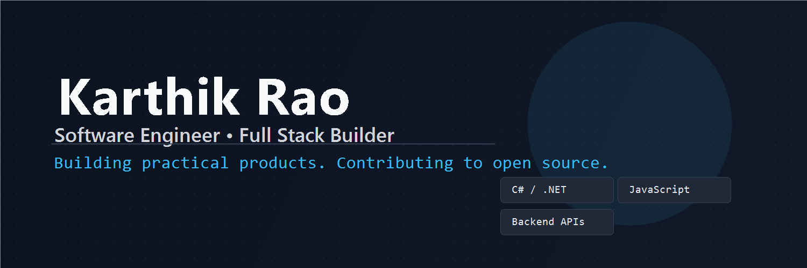

  

<h1 align="center">Karthik Rao</h1>

<b>Software Engineer • Full Stack Builder • Open Source Contributor</b>

  

  
  
  

---

## What I'm Focused On

- Building: [Snapory](https://github.com/karthikurao/snapory)
- Learning deeply: `.NET`, backend architecture, and system design
- Contributing to: Open source projects with real developer/product impact
- Preferred collaboration: Feature work, bug fixes, refactors, docs, contributor UX

---

## Featured Work

### Snapory
Repository: [karthikurao/snapory](https://github.com/karthikurao/snapory)

- **Problem:** Make core user flows simple and reliable.
- **Built:** End-to-end feature paths across backend and frontend with maintainable structure.
- **Impact:** Faster iteration and cleaner foundation for contributors.

### LinkShield AI
Repository: [karthikurao/linkshield-ai](https://github.com/karthikurao/linkshield-ai)

- **Problem:** Repetitive/manual link-content analysis workflows.
- **Built:** AI-assisted analysis flow with practical automation.
- **Impact:** Reduced manual effort and improved developer workflow.

---

## Open Source

I’m actively open to contributing in these areas:

- Backend APIs and service design
- Full stack feature implementation
- Tooling and developer productivity
- Performance improvements and cleanup refactors
- Documentation and onboarding improvements

If you maintain a project and need help, I’m happy to collaborate.

---

## Tech Stack

  
  
  
  
  
  
  
  

---

## Connect

  
  
  
  
  

---

<i>Build useful things. Share what you learn. Contribute back.</i>

